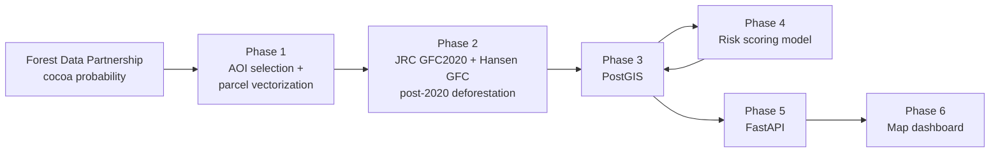

# EUDR Forest Risk Assessment Tool

An open-source geospatial pipeline that screens agricultural parcels for
deforestation risk under the EU Deforestation Regulation (EUDR) — combining
satellite-derived land-cover probability, forest-loss detection, and a
machine-learning risk model, served through a REST API and an interactive
map dashboard.

> Inspired by commercial EUDR compliance platforms (e.g. LiveEO's
> TradeAware), this project implements a simplified, fully open-data
> proof-of-concept of the core geospatial deforestation-risk pipeline.

## Why this project

The EUDR (Regulation (EU) 2023/1115) requires operators placing cocoa,
coffee, cattle, palm oil, rubber, soy, or wood products on the EU market to
prove their supply chain is free of deforestation occurring after
**31 December 2020**. Large/medium operators must comply by
**30 December 2026**. Companies sourcing from thousands of smallholder plots
need a way to screen parcels at scale — this project demonstrates that
pipeline end-to-end, using only open, official datasets.

## Highlights

- 4,170 real parcels (0.5–85 ha) derived from satellite-based cocoa
  probability data — no synthetic or confidential data.
- Study area selected **programmatically** via data-driven clustering, not
  chosen by hand.
- 70 parcels (1.7%) show measurable post-2020 forest loss, up to 79.9% of
  their area.
- Risk model improved from macro-F1 0.43 to 0.84 (binary) through a
  documented, honest iteration process (v1 → v2 → v3).
- REST API (FastAPI) + interactive map dashboard (Leaflet, glass UI).

## Architecture



## Study area: Alto Sinú / Nudo de Paramillo, Colombia

Rather than picking a region by hand, the area of interest (AOI) was
selected through a reproducible procedure:

1. Load Colombia's real administrative boundary (not a bounding box).
2. Threshold the Forest Data Partnership cocoa-probability raster (> 0.3)
   and cluster connected components at 1 km resolution.
3. Select the largest cluster (~1,103 km²) and take its centroid.
4. Define the AOI as a 20 km buffer around that centroid (~1,600 km²).

Result: the **Alto Sinú** region (Córdoba–Antioquia border, near PNN
Paramillo) — a documented agricultural frontier with active deforestation
pressure, relevant to both cocoa and palm oil (both EUDR commodities). The
same procedure is directly applicable to the other countries covered by
Forest Data Partnership (Côte d'Ivoire, Ghana, Indonesia, Ecuador, Peru).

## Tech stack

| Layer | Tools |
|---|---|
| Remote sensing / geoprocessing | Google Earth Engine, geemap, geopandas, rasterio, shapely |
| Database | PostgreSQL + PostGIS (Docker) |
| Machine learning | scikit-learn (Random Forest, Logistic Regression) |
| API | FastAPI, SQLAlchemy, GeoAlchemy2 |
| Frontend | HTML / CSS / JS, Leaflet |
| Environment | uv (pyproject.toml) |

## Project structure

```
.
├── data/                          # GeoJSON / CSV intermediate outputs
├── docs/
│   ├── PIPELINE.md                # canonical run order + diagnostic scripts
│   ├── CODE_AUDIT.md              # pre-Phase-7 code review
│   └── phase4_model_comparison.md # full model comparison + sensitivity check
├── docker/
│   ├── docker-compose.yml         # db + api + frontend stack
│   └── init/                      # SQL seed (4,170 scored parcels), auto-loaded
├── src/
│   ├── phase1_aoi_parcels.py
│   ├── phase2_deforestation.py
│   ├── phase3_postgis.py
│   ├── phase4_scoring.py          # v2 (superseded, kept for documentation)
│   ├── phase4_distance.py
│   ├── phase4_neighborhood_multi.py
│   ├── phase4_scoring_v3.py       # final model
│   ├── api/                       # FastAPI app (+ Dockerfile)
│   └── frontend/                  # static map dashboard (+ Dockerfile)
└── pyproject.toml
```

## Getting started

There are two paths. **Quick start** runs the whole stack from a pre-loaded
database snapshot — no Earth Engine, no Python pipeline, just Docker. **Full
pipeline** regenerates every dataset from source imagery (requires Google Earth
Engine credentials).

### Quick start (Docker, pre-loaded data)

The only prerequisite is **Docker Desktop**. The PostGIS container auto-loads a
seed dump (`docker/init/`) with all 4,170 parcels already scored, so the API and
dashboard work immediately.

```bash
# from the repo root
docker compose -f docker/docker-compose.yml up --build
```

Then open:

| Service | URL |
|---|---|
| Dashboard | http://localhost:8080 |
| API docs (Swagger) | http://localhost:8000/docs |
| PostGIS | `localhost:5432` (`eudr` / `eudr_dev_password` / `eudr_risk`) |

The stack is three services — `db` (PostGIS + seed), `api` (FastAPI), and
`frontend` (nginx). The API waits for the database healthcheck before starting;
the dashboard's API base URL is injected at container start via `API_BASE_URL`.
To reset to a clean slate (re-load the seed): `docker compose -f
docker/docker-compose.yml down -v` then `up --build` again.

### Full pipeline (regenerate data from Earth Engine)

Use this only to rebuild the datasets from scratch. Requires Python 3.10+,
[uv](https://docs.astral.sh/uv/), Docker Desktop, and a Google Earth Engine
account with a linked Google Cloud project.

```bash
uv sync
uv run python -c "import ee; ee.Authenticate()"
docker compose -f docker/docker-compose.yml up -d db   # PostGIS only
```

Then run the pipeline in order (see [`docs/PIPELINE.md`](docs/PIPELINE.md) for
the full contract and the diagnostic/superseded scripts):

```bash
uv run python src/phase1_aoi_parcels.py        # -> data/farms.geojson
uv run python src/phase2_deforestation.py      # -> data/farms_risk_raw.csv
uv run python src/phase3_postgis.py            # loads PostGIS
uv run python src/phase4_distance.py           # -> data/farms_distance.csv
uv run python src/phase4_neighborhood_multi.py # -> data/farms_neighborhood_multi.csv
uv run python src/phase4_scoring_v3.py         # trains model, updates risk_score/risk_class
```

Run the API and dashboard directly (without their containers):

```bash
uv run uvicorn src.api.main:app --reload                       # http://localhost:8000/docs
uv run python -m http.server 8080 --directory src/frontend     # http://localhost:8080
```

To refresh the Docker seed after regenerating data:
`docker exec eudr_postgis pg_dump -U eudr -d eudr_risk --no-owner --no-privileges
-t public.farms -t public.assessments > docker/init/20_eudr_risk.sql` (then
re-add the `CREATE EXTENSION IF NOT EXISTS postgis;` header).

## Methodology summary

### Phase 1 — Parcels

4,170 polygons derived by thresholding the Forest Data Partnership
cocoa-probability raster (> 0.3) within the AOI, vectorized at 10 m, and
filtered to a 0.5–85 ha size range (the ~99th percentile of observed cluster
sizes — excludes both pixel-level noise and aggregated mega-clusters). Mean
parcel size: **2.90 ha** — closely matching the ~3 ha average reported for
Colombian cocoa smallholders.

### Phase 2 — Deforestation

For each parcel: % of its area with forest loss after 2021 (Hansen GFC
`lossyear ≥ 21`) on pixels classified as forest in 2020 (JRC GFC2020) — i.e.
deforestation occurring after the EUDR cutoff date (31 Dec 2020).

| Metric | Value |
|---|---|
| Parcels with any post-2020 loss | 70 / 4,170 (1.7%) |
| Maximum `defo_pct` | 79.9% |
| Parcels with > 50% area deforested | 6 |

### Phase 4 — Risk model (v1 → v2 → v3)

| Version | Approach | Result |
|---|---|---|
| v1 | RF on `[area_ha, defo_pct]` → `risk_class` derived from `defo_pct` | precision/recall ≈ 1.00 — **target leakage**, discarded |
| v2 | RF on `[area_ha, neighborhood_defo_pct]` (200 m ring, excludes own parcel) | macro-F1 = 0.43 — honest, but underpowered |
| v3 | RF on `[area_ha, dist_to_defo_m, nb_defo_pct_{200,500,1000}]`, 5-fold stratified CV, binary framing | **PR-AUC 0.846 (0.812 under masked-distance sensitivity check), ROC-AUC 0.997, macro-F1 0.837** |

Full comparison, feature importances, and the leakage sensitivity check:
[`docs/phase4_model_comparison.md`](docs/phase4_model_comparison.md)

`risk_class` (LOW / MEDIUM / HIGH) is always the rule-based ground truth,
derived from the parcel's own `defo_pct` (threshold = median `defo_pct`
among affected parcels, 5.38%). `risk_score` is the v3 model's
`P(AFFECTED)` for every parcel — a **prioritization aid**, not a compliance
verdict.

### The product: early warning

For the 4,100 currently "compliant" (LOW) parcels, `risk_score` flags those
embedded in actively-cleared surroundings — i.e. parcels with no detected
deforestation of their own, but at elevated risk given their context.
Example: parcel **3123** — 0% own deforestation, 40 m from recent forest
loss, 2.0% loss within its 200 m ring → `risk_score = 0.29`, the highest
among all LOW parcels.

## API reference

| Endpoint | Description |
|---|---|
| `GET /farms` | GeoJSON `FeatureCollection`. Query params: `risk_class`, `min_risk_score`, `limit`, `offset` |
| `GET /farms/{farm_id}` | Single parcel as a GeoJSON `Feature` |
| `GET /stats` | Aggregate counts and score statistics per `risk_class`, total parcels, total area |
| `GET /early-warning` | LOW-risk parcels ranked by `risk_score` (descending) — the core product output |

Interactive documentation at `/docs` (Swagger UI).

## Limitations and honest caveats

- **Small positive sample (N = 70).** Cross-validation metrics carry wide
  variance with this sample size; treat the ranking between model variants
  as indicative, not definitive.
- **EUDR compliance is zero-tolerance and binary** (any post-2020
  deforestation on a parcel makes it non-compliant). `risk_score` is
  probabilistic and intended for **prioritization and screening**, not as a
  compliance determination — a low score never certifies a parcel as
  deforestation-free.
- **Satellite definitions of "forest" do not exactly match EUDR/FAO
  land-use definitions.** This tool supports risk assessment, not legal
  compliance determination.
- Hansen GFC and JRC GFC2020 carry their own omission/commission errors and
  a 10–30 m resolution mismatch, which propagate into both labels and
  features.
- `dist_to_defo_m` is capped at 2,560 m — an arbitrary modeling choice,
  documented in `docs/phase4_model_comparison.md`.

## Scope

This project implements the core geospatial deforestation-detection layer
of an EUDR risk-assessment system. Supply-chain traceability (ERP
integration), legality/human-rights checks, and EU Information System / DDS
submission are out of scope, but would be the natural next layers in a
production system.

## Data sources

- [JRC Global Forest Cover 2020](https://forest-observatory.ec.europa.eu/)
  — EUDR reference layer for the 31 Dec 2020 cutoff date
- [UMD/Hansen Global Forest Change](https://glad.earthengine.app/view/global-forest-change)
  — annual forest loss
- [Forest Data Partnership — Cocoa Probability Model](https://www.forestdatapartnership.org/)
  — parcel source data
- [Copernicus Sentinel-2](https://sentinel.esa.int/) — visual verification
- [USDOS LSIB](https://earthengine.google.com/) — Colombia administrative
  boundary
