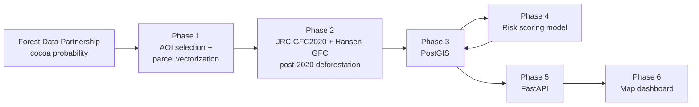

# EUDR Forest Risk Assessment Tool

[](https://github.com/saulo1112/EUDR_Risk_Assessment/actions/workflows/ci.yml)
[](LICENSE)
[](https://www.python.org/downloads/)
[](https://github.com/astral-sh/ruff)

An open-source geospatial pipeline that screens agricultural parcels for
deforestation risk under the EU Deforestation Regulation (EUDR). It combines
satellite-derived land-cover probability, forest-loss detection, and a
machine-learning risk model, then serves the result through a REST API and an
interactive map dashboard.

<!-- Screenshot: start the stack, open http://localhost:8080, capture the
     dashboard and save it as docs/img/dashboard.png, then uncomment the line
     below. Placed here because it is the first thing a reader should see.

-->

> Inspired by commercial EUDR compliance platforms (e.g. LiveEO's
> TradeAware), this project implements a simplified, fully open-data
> proof-of-concept of the core geospatial deforestation-risk pipeline.

**Live demo:** [dashboard](https://saulo1112.github.io/EUDR_Risk_Assessment/)
(API docs at [eudr-risk-api.onrender.com/docs](https://eudr-risk-api.onrender.com/docs)).
The dashboard is a static build on GitHub Pages, pointed at a FastAPI + PostGIS
backend hosted on Render's free tier. Both are free instances, so the API can
take 30 to 50 seconds to wake up after a few minutes without traffic; that is
normal, not a bug.

**Run it locally in one command:**
`docker compose -f docker/docker-compose.yml up --build`, then open
[localhost:8080](http://localhost:8080). The database ships pre-seeded, so no
Earth Engine credentials are needed to run the demo.

## Why this project

The EUDR (Regulation (EU) 2023/1115) requires operators placing cocoa,
coffee, cattle, palm oil, rubber, soy, or wood products on the EU market to
prove their supply chain is free of deforestation occurring after
**31 December 2020**. Large and medium operators must comply by
**30 December 2026**. Companies sourcing from thousands of smallholder plots
need a way to screen parcels at scale. This project builds that pipeline from
end to end, using only open, official datasets.

## Highlights

- 4,170 real parcels (0.5 to 85 ha) derived from satellite-based cocoa
  probability data, no synthetic or confidential data.
- Study area selected programmatically through data-driven clustering, not
  chosen by hand.
- 70 parcels (1.7%) show measurable post-2020 forest loss, up to 79.9% of
  their area.
- Risk model improved from macro-F1 0.43 to 0.84 (binary) through a
  documented iteration process (v1 to v2 to v3), including a leakage check on
  the winning feature.
- REST API (FastAPI) plus an interactive map dashboard (Leaflet, glass UI).
- One `docker compose up` starts a pre-seeded PostGIS, the API, and the
  dashboard. 72 tests (unit, API, and integration) plus a lint gate run in CI.
- Deployed: static frontend on GitHub Pages, API and database on Render.

## Architecture


```mermaid
flowchart LR
    A[Forest Data Partnership\ncocoa probability] --> B[Phase 1\nAOI selection +\nparcel vectorization]
    B --> C[Phase 2\nJRC GFC2020 + Hansen GFC\npost-2020 deforestation]
    C --> D[Phase 3\nPostGIS]
    D --> E[Phase 4\nRisk scoring model]
    E --> D
    D --> F[Phase 5\nFastAPI]
    F --> G[Phase 6\nMap dashboard]
```

## Study area: Alto Sinú / Nudo de Paramillo, Colombia

Rather than picking a region by hand, the area of interest (AOI) was
selected through a reproducible procedure:

1. Load Colombia's real administrative boundary (not a bounding box).
2. Threshold the Forest Data Partnership cocoa-probability raster (> 0.3)
   and cluster connected components at 1 km resolution.
3. Select the largest cluster (~1,103 km²) and take its centroid.
4. Define the AOI as a 20 km buffer around that centroid (~1,600 km²).

The result is the **Alto Sinú** region, on the Córdoba-Antioquia border near
PNN Paramillo: a documented agricultural frontier with active deforestation
pressure, relevant to both cocoa and palm oil (both EUDR commodities). The
same procedure applies directly to the other countries covered by Forest Data
Partnership (Côte d'Ivoire, Ghana, Indonesia, Ecuador, Peru).

## Tech stack

| Layer | Tools |
|---|---|
| Remote sensing / geoprocessing | Google Earth Engine, geemap, geopandas, rasterio, shapely |
| Database | PostgreSQL + PostGIS (Docker) |
| Machine learning | scikit-learn (Random Forest, Logistic Regression) |
| API | FastAPI, SQLAlchemy, GeoAlchemy2 |
| Frontend | HTML / CSS / JS, Leaflet |
| Tooling | uv, pytest, ruff, GitHub Actions |
| Hosting | GitHub Pages (frontend), Render (API + PostGIS) |

## Project structure

```
.
├── data/                            # GeoJSON / CSV pipeline outputs
├── docs/
│   ├── PIPELINE.md                  # canonical run order + shared modules
│   ├── CODE_AUDIT.md                # self-review: resolved and open findings
│   ├── phase4_model_comparison.md   # model comparison + leakage sensitivity check
│   └── img/
├── docker/
│   ├── docker-compose.yml           # db + api + frontend stack
│   └── init/20_eudr_risk.sql.gz     # seed: 4,170 scored parcels, auto-loaded
├── src/
│   ├── config.py                    # single source of truth for settings
│   ├── pipeline/
│   │   ├── earth_engine.py          # EUDR reference layers, defined once
│   │   ├── scoring.py               # pure model logic (side-effect free)
│   │   ├── phase1_aoi_parcels.py ... phase4_scoring_v3.py
│   │   └── legacy/                  # superseded v2 model, kept as a record
│   ├── api/                         # FastAPI app (+ Dockerfile)
│   └── frontend/                    # static map dashboard (+ Dockerfile)
├── scripts/                         # ad-hoc connectivity / sanity checks
├── tests/                           # unit, API and integration tests
├── render.yaml                      # Render blueprint (API + Postgres)
└── .github/workflows/               # CI, GitHub Pages deploy
```

Two things worth knowing before reading the code:

- `src/pipeline/scoring.py` holds the model logic with no side effects, so it
  can be unit-tested without a database or Earth Engine. The `phase*` scripts
  are thin orchestrators that do their work inside `main()`.
- `src/config.py` is the only place connection strings, the Earth Engine
  project, and the model thresholds are defined. Everything is
  environment-overridable.

## Getting started

There are two paths. **Quick start** runs the whole stack from a pre-loaded
database snapshot: no Earth Engine, no Python pipeline, just Docker. **Full
pipeline** regenerates every dataset from source imagery and requires a Google
Earth Engine account.

### Quick start (Docker, pre-loaded data)

The only prerequisite is **Docker Desktop**. The PostGIS container auto-loads a
seed dump (`docker/init/`) with all 4,170 parcels already scored, so the API
and dashboard work immediately.

```bash
# from the repo root
docker compose -f docker/docker-compose.yml up --build
```

Then open:

| Service | URL |
|---|---|
| Dashboard | http://localhost:8080 |
| API docs (Swagger) | http://localhost:8000/docs |
| PostGIS | `localhost:5432` (`eudr` / `eudr_dev_password` / `eudr_risk`) |

The stack is three services: `db` (PostGIS + seed), `api` (FastAPI), and
`frontend` (nginx). The API waits for the database healthcheck before
starting, and the dashboard's API base URL is injected at container start via
`API_BASE_URL`. To reset to a clean slate and re-load the seed, run
`docker compose -f docker/docker-compose.yml down -v` then `up --build` again.

If any of those ports are already taken on your machine, override them
without editing the compose file:

```bash
API_PORT=8001 FRONTEND_PORT=8081 DB_PORT=5433 \
  docker compose -f docker/docker-compose.yml up --build
```

### Full pipeline (regenerate data from Earth Engine)

Use this only to rebuild the datasets from scratch. It requires Python 3.10+,
[uv](https://docs.astral.sh/uv/), Docker Desktop, and a Google Earth Engine
account with a linked Google Cloud project.

**1. Install dependencies and authenticate with Earth Engine:**

```bash
uv sync
uv run python -c "import ee; ee.Authenticate()"
```

**2. Start PostGIS and keep it running** in its own terminal (or as a
background process) for the rest of this section. Every step below connects
to it over `localhost:5432`:

```bash
docker compose -f docker/docker-compose.yml up -d db   # PostGIS only, detached
docker compose -f docker/docker-compose.yml ps         # confirm "db" is Up/healthy
```

**3. Run the pipeline in order** (see [`docs/PIPELINE.md`](docs/PIPELINE.md)
for the full data contract and the diagnostic/superseded scripts). Scripts run
as modules so their absolute imports resolve:

```bash
uv run python -m src.pipeline.phase1_aoi_parcels        # -> data/farms.geojson
uv run python -m src.pipeline.phase2_deforestation      # -> data/farms_risk_raw.csv
uv run python -m src.pipeline.phase3_postgis            # loads PostGIS
uv run python -m src.pipeline.phase4_distance           # -> data/farms_distance.csv
uv run python -m src.pipeline.phase4_neighborhood_multi # -> data/farms_neighborhood_multi.csv
uv run python -m src.pipeline.phase4_scoring_v3         # trains model, writes risk_score/risk_class
```

**4. Run the API and dashboard directly** (without their containers). The `db`
container from step 2 must still be running, or the API will fail with
`psycopg2.OperationalError: connection refused` on `localhost:5432`:

```bash
uv run uvicorn src.api.main:app --reload                       # http://localhost:8000/docs
uv run python -m http.server 8080 --directory src/frontend     # http://localhost:8080
```

> **Troubleshooting:** if `/stats`, `/farms`, or `/early-warning` return a
> `500` with `connection to server at "localhost" ... Connection refused`,
> PostGIS isn't running. Run
> `docker compose -f docker/docker-compose.yml up -d db` and retry. No need
> to restart uvicorn, it reconnects on the next request.

To refresh the Docker seed after regenerating data:

```bash
{ echo "CREATE EXTENSION IF NOT EXISTS postgis;"; \
  docker exec eudr_postgis pg_dump -U eudr -d eudr_risk \
    --no-owner --no-privileges -t public.farms -t public.assessments; \
} | gzip -9 > docker/init/20_eudr_risk.sql.gz
```

The `CREATE EXTENSION` header is prepended because the dump is restricted to
the two application tables. The file is gzipped (2.9 MB instead of 24 MB)
because PostgreSQL's entrypoint decompresses `.sql.gz` seeds natively.

## Deploying

GitHub Pages only serves static files, so it can host the dashboard
(`src/frontend/`) but not the API or PostGIS. A full live demo needs two
pieces: the backend on a platform that runs containers ([Render](https://render.com)
is used here, since its free tier includes a Postgres database with PostGIS
support and a web service), and the frontend on GitHub Pages, pointed at that
backend. This is exactly how the live demo above is deployed.

**1. Deploy the API and database to Render**

- Push this repo to GitHub, then in Render: **New +** then **Blueprint**,
  select the repo. Render reads [`render.yaml`](render.yaml) and provisions
  both resources (free tier) automatically.
- Render's managed Postgres has no equivalent to
  `docker-entrypoint-initdb.d`, so the seed is loaded once by hand after the
  database is up. Grab its **External Database URL** from the Render
  dashboard and run:

  ```bash
  psql "$RENDER_EXTERNAL_DATABASE_URL" -c "CREATE EXTENSION IF NOT EXISTS postgis;"
  gunzip -c docker/init/20_eudr_risk.sql.gz | psql "$RENDER_EXTERNAL_DATABASE_URL"
  ```

  No local `psql`? Run the same commands through the postgis Docker image
  instead: `docker run --rm postgis/postgis:16-3.4 psql "$RENDER_EXTERNAL_DATABASE_URL" -c "..."`.

- Once the API service finishes deploying, note its public URL
  (`https://eudr-risk-api.onrender.com` in this deployment) and confirm
  `/stats` responds.

**2. Deploy the dashboard to GitHub Pages**

- Repo **Settings**, then **Pages**: set **Source** to **GitHub Actions**.
- Repo **Settings**, then **Secrets and variables**, then **Actions**, then
  the **Variables** tab: add a repository variable `API_BASE_URL` set to the
  Render API URL from step 1.
- Push to `main`, or run the *Deploy frontend to GitHub Pages* workflow
  manually from the **Actions** tab. It regenerates `config.js` with that URL
  and publishes `src/frontend/`. See
  [`.github/workflows/deploy-pages.yml`](.github/workflows/deploy-pages.yml).
- The dashboard is then live at `https://<username>.github.io/<repo>/`. CORS
  needs no changes: the API already allows any origin
  (`allow_origins=["*"]` in `src/api/main.py`).

**Free-tier caveats** worth knowing before sharing the link: Render's free
Postgres is deleted after 90 days on the plan, and the free web service spins
down after 15 minutes idle. The first request after a quiet period takes 30
to 50 seconds to cold-start rather than failing outright.

## Testing

```bash
uv run pytest                  # unit + API tests, no database or GEE needed
uv run pytest -m integration   # integration tests, needs the seeded db container
uv run ruff check .            # lint
```

| Suite | Scope |
|---|---|
| `tests/test_scoring.py` | Pure model logic: `classify()` boundaries, label framings, feature-set integrity (including a guard that no variant leaks the label), model reproducibility |
| `tests/test_schemas.py` | Pydantic response contracts and GeoJSON serialization |
| `tests/test_api.py` | Every endpoint via `TestClient`, with the database dependency replaced by an in-memory fake: filtering, pagination, 404s, aggregation, CORS |
| `tests/test_integration_db.py` | Dataset invariants against real PostGIS: 4,170 parcels, class distribution, scores as probabilities, `risk_class` consistent with `defo_pct`, valid EPSG:4326 geometries |

Integration tests are opt-in through the `integration` marker, so `pytest`
stays green on a machine with no infrastructure. CI runs both, see
[`.github/workflows/ci.yml`](.github/workflows/ci.yml).

## Methodology summary

### Phase 1: Parcels

4,170 polygons derived by thresholding the Forest Data Partnership
cocoa-probability raster (> 0.3) within the AOI, vectorized at 10 m, and
filtered to a 0.5 to 85 ha size range (the ~99th percentile of observed
cluster sizes, which excludes both pixel-level noise and aggregated
mega-clusters). Mean parcel size is **2.90 ha**, close to the ~3 ha average
reported for Colombian cocoa smallholders.

### Phase 2: Deforestation

For each parcel: percent of its area with forest loss after 2021 (Hansen GFC
`lossyear >= 21`) on pixels classified as forest in 2020 (JRC GFC2020). In
other words, deforestation occurring after the EUDR cutoff date of 31 Dec
2020.

| Metric | Value |
|---|---|
| Parcels with any post-2020 loss | 70 / 4,170 (1.7%) |
| Maximum `defo_pct` | 79.9% |
| Parcels with > 50% area deforested | 6 |

### Phase 4: Risk model (v1 to v2 to v3)

| Version | Approach | Result |
|---|---|---|
| v1 | RF on `[area_ha, defo_pct]`, `risk_class` derived from `defo_pct` | precision/recall ~1.00, **target leakage**, discarded |
| v2 | RF on `[area_ha, neighborhood_defo_pct]` (200 m ring, excludes own parcel) | macro-F1 = 0.43, honest but underpowered |
| v3 | RF on `[area_ha, dist_to_defo_m, nb_defo_pct_{200,500,1000}]`, 5-fold stratified CV, binary framing | **PR-AUC 0.846 (0.812 under masked-distance sensitivity check), ROC-AUC 0.997, macro-F1 0.837** |

Full comparison, feature importances, and the leakage sensitivity check are in
[`docs/phase4_model_comparison.md`](docs/phase4_model_comparison.md).

`risk_class` (LOW / MEDIUM / HIGH) is always the rule-based ground truth,
derived from the parcel's own `defo_pct` (threshold is the median `defo_pct`
among affected parcels, 5.38%). `risk_score` is the v3 model's `P(AFFECTED)`
for every parcel: a prioritization aid, not a compliance verdict.

### The product: early warning

For the 4,100 currently "compliant" (LOW) parcels, `risk_score` flags the ones
embedded in actively cleared surroundings: no detected deforestation of their
own, but elevated risk given their context. Parcel **3123** is the clearest
example: 0% own deforestation, 40 m from recent forest loss, 2.0% loss within
its 200 m ring, giving `risk_score = 0.29`, the highest among all LOW parcels.

## API reference

| Endpoint | Description |
|---|---|
| `GET /farms` | GeoJSON `FeatureCollection`. Query params: `risk_class`, `min_risk_score`, `limit`, `offset` |
| `GET /farms/{farm_id}` | Single parcel as a GeoJSON `Feature` |
| `GET /stats` | Aggregate counts and score statistics per `risk_class`, total parcels, total area |
| `GET /early-warning` | LOW-risk parcels ranked by `risk_score` descending: the core product output |

Interactive documentation is at `/docs` (Swagger UI).

## Limitations and honest caveats

- **Small positive sample (N = 70).** Cross-validation metrics carry wide
  variance at this sample size. Treat the ranking between model variants as
  indicative, not definitive.
- **EUDR compliance is zero-tolerance and binary** (any post-2020
  deforestation on a parcel makes it non-compliant). `risk_score` is
  probabilistic and meant for prioritization and screening, not as a
  compliance determination. A low score never certifies a parcel as
  deforestation-free.
- **Satellite definitions of "forest" do not exactly match EUDR/FAO
  land-use definitions.** This tool supports risk assessment, not legal
  compliance determination.
- Hansen GFC and JRC GFC2020 carry their own omission and commission errors,
  plus a 10 to 30 m resolution mismatch, both of which propagate into the
  labels and the features.
- `dist_to_defo_m` is capped at 2,560 m, an arbitrary modeling choice
  documented in `docs/phase4_model_comparison.md`.
- **87% of parcel polygons have self-intersecting rings**, a known artefact
  of vectorizing a 10 m raster (pixel outlines touch at diagonal corners). It
  does not affect the results reported here: areas come from pixel counts,
  features are computed in Earth Engine, and GeoJSON serialization is
  unaffected. It would need `ST_MakeValid` before any spatial-overlay
  analysis. Surfaced by the integration tests and documented in
  [`docs/CODE_AUDIT.md`](docs/CODE_AUDIT.md).

## Scope

This project implements the core geospatial deforestation-detection layer of
an EUDR risk-assessment system. Supply-chain traceability (ERP integration),
legality and human-rights checks, and EU Information System / DDS submission
are out of scope. They would be the natural next layers in a production
system.

## Data sources

- [JRC Global Forest Cover 2020](https://forest-observatory.ec.europa.eu/):
  EUDR reference layer for the 31 Dec 2020 cutoff date
- [UMD/Hansen Global Forest Change](https://glad.earthengine.app/view/global-forest-change):
  annual forest loss
- [Forest Data Partnership, Cocoa Probability Model](https://www.forestdatapartnership.org/):
  parcel source data
- [Copernicus Sentinel-2](https://sentinel.esa.int/): visual verification
- [USDOS LSIB](https://earthengine.google.com/): Colombia administrative
  boundary

## Contributing

Development setup, checks, and project conventions are in
[`CONTRIBUTING.md`](CONTRIBUTING.md).

## License

[MIT](LICENSE). The code is open source; the underlying datasets keep their
own licences (see *Data sources* above).
